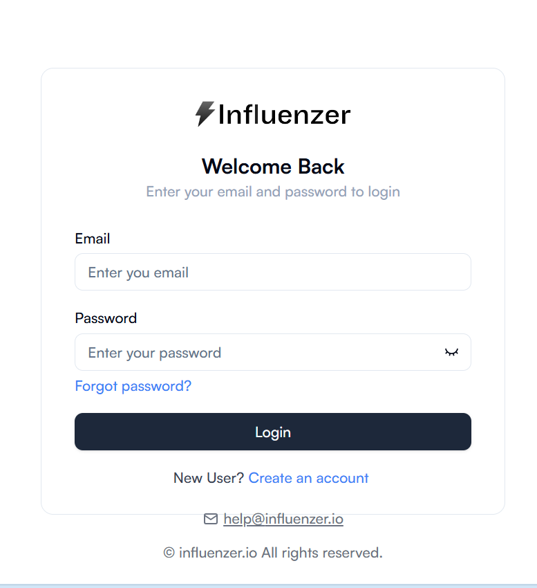
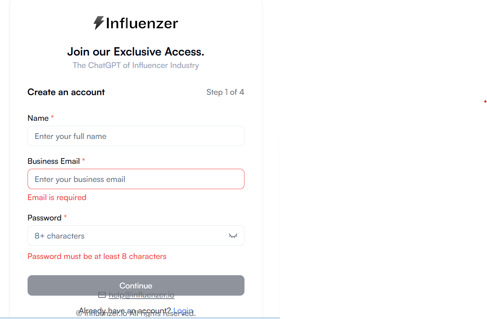
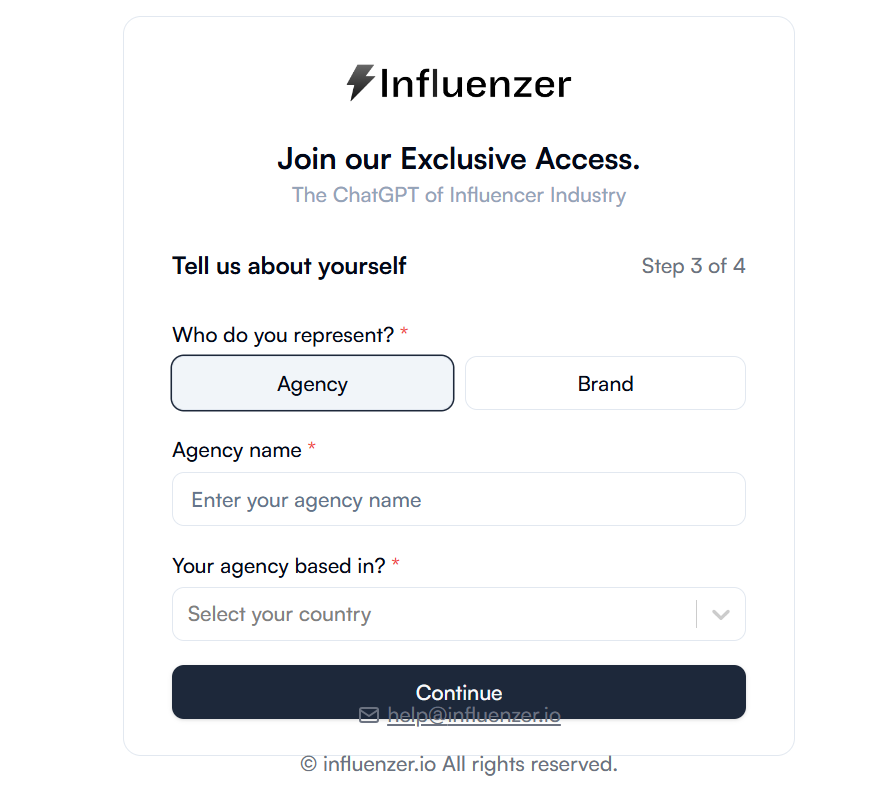
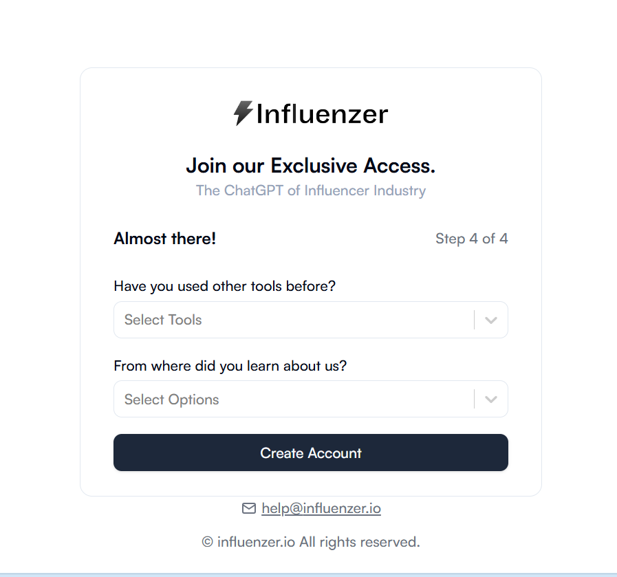
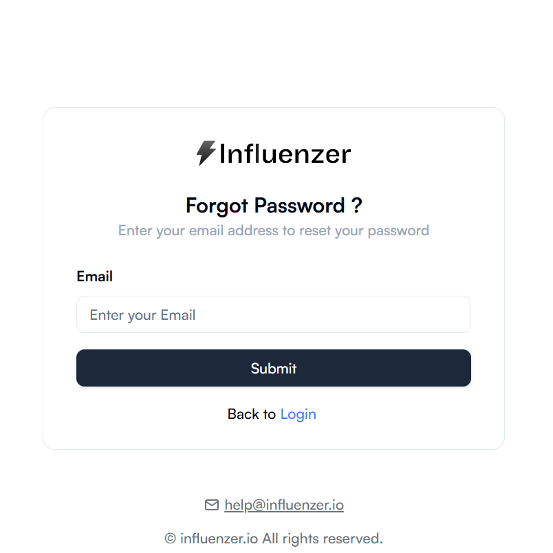

# Influenzer User Guide

This guide provides step-by-step instructions for logging in, signing up, and resetting your password on Influenzer.io.

---

## Login Page

### Overview
The login page allows users to access their Influenzer account using a **company or approved email address** and password.

### Fields
- **Email Address** – restricted to approved domains.
- **Password** – includes a **show/hide toggle icon** (👁).
- **Login** button.
- Navigation links:
  - **Forgot Password**
  - **Sign Up**

### Step-by-Step Login Process

1. **Enter Your Approved Email Address**
   - Only **company/test accounts** are accepted.
   - Public domains like `gmail.com`, `yahoo.com`, `outlook.com` **will not work**.
   - Examples:
     - ✅ `test.user@influenzer.io`  
     - ✅ `qa.user@companydomain.com`  
     - ❌ `john.doe@gmail.com`

2. **Enter Your Password**
   - Must match the password provided for your account.
   - Click the **👁 icon** to toggle password visibility.

3. **Click the “Log In” Button**
   - Activates only when both fields contain valid inputs.
   - If your email domain is not approved, login will fail.

### Error Messages
- **"Invalid email or password"** – Email/password doesn’t match account.  
- **"User with this email does not exist"** – Incorrect email.  
- **Server error** – Backend or network issue.

---

## Signup Page (Step 1 of 4)

### Overview
Create a new Influenzer account with your business email.

### Fields
- **Full Name*** – Required.
- **Business Email*** – Required, restricted to approved domains.
- **Password*** – Required, minimum 8 characters.
- **Continue** button – Disabled until all fields are valid.

Links:
- **Already have an account? Login**
- **Contact support** via [help@influenzer.io](mailto:help@influenzer.io)

### Step-by-Step Process

1. **Enter Your Full Name**
   - Example: `Alex Johnson`

2. **Enter Your Business Email**
   - Must be an approved domain.
   - Examples:
     - ✅ `alex.johnson@influenzer.io`  
     - ✅ `qa.user@companydomain.com`  
     - ❌ `alex.johnson@gmail.com`

3. **Create a Password**
   - Minimum 8 characters.
   - Recommended: uppercase, lowercase, number, symbol.
   - Example: `Secure@2024`

4. **Click “Continue”**
   - Button remains **disabled** until all fields are valid.
   - Success moves you to **Step 2 of 4**.

---

## Step 2 of 4: Email Verification

1. **Check Your Email Inbox**
   - Verification code sent to the email entered in Step 1.
   - Example: `dhruvi@onedomain.com`

2. **Enter the 6-Digit Code**
   - Enter exactly as shown in the email.
   - Valid for a limited time.

3. **Didn’t Receive the Code?**
   - Click **"Resend code"**.
   - Check **Spam/Promotions** folders.

4. **Click “Continue”**
   - Disabled until all 6 code boxes are filled.
   - Proceeds to **Step 3 of 4** on success.

---

## Step 3 of 4: Who do you represent?

### Overview
Collects information about professional affiliation to tailor the platform experience.

### Fields
1. **Who do you represent?*** – Radio button: Agency or Brand.
2. **Agency or Brand Name*** – Text input: `Enter your agency or brand name`.
3. **Your agency or brand based in?*** – Dropdown selection of countries.

### Actions
- **Continue** – Validates form and proceeds to Step 4.

### Notes
- Fields marked with `*` are mandatory.
- Default selection is **Agency** if none is chosen.

---

## Step 4 of 4: Almost there!

### Overview
Gathers prior tool experience and referral source to personalize onboarding.

### Fields
1. **Have you used other tools before?** – Dropdown/multi-select.
2. **From where did you learn about us?** – Dropdown selection.

### Actions
- **Create Account** – Submits data, creates account, redirects to login, then dashboard.

### Notes
- Both fields recommended for personalized onboarding.
- Complete selections to proceed.

---

## Password Reset Process

1. **Enter Your Registered Email**
   - Linked to your Influenzer.io account.
   - Example: `alex.johnson@companydomain.com`

2. **Submit the Request**
   - Click **Submit**.
   - Success: "Reset password email sent successfully"
   - Failure: *"No account found with this email"*

3. **Check Your Inbox**
   - Open reset email from `help@influenzer.io`.
   - Follow link to create a new password.

4. **Return to Login Page**
   - Log in using your **new password**.

---

## Support
- **Email:** [help@influenzer.io](mailto:help@influenzer.io)

---

